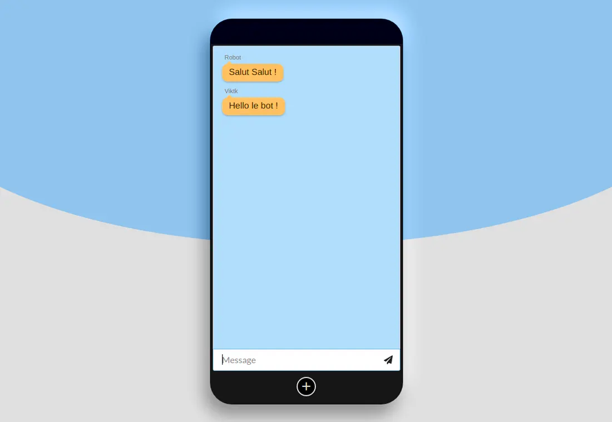

# Messagerie chat instantanée

## Réalisation 

Messagerie instantanée, coder avec React et Redux. Utilisation de Socketio permettant une communication bidirectionnelle en temps réel entre les clients Web et les serveurs.



## Développement

Vous souhaitez exécuter une démo local

- Récupérez et exécutez le serveur suivant :
```bash
git clone https://github.com/viktk/chatroom-server-viktk
npm install
npm start
url : http://localhost:3000
```

- Récupérez le projet suivant :
```bash
git clone https://github.com/viktk/chatroom-viktk
npm install
npm start
url : http://localhost:8080
```
